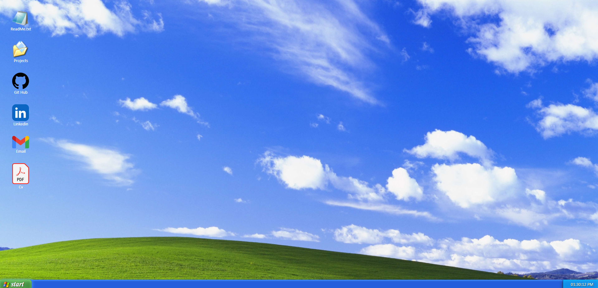

# Windows XP Style
<a href="https://portfolio-ivan-windows-xp.netlify.app/">Ver el Portfolioo</a>
## Acerca del Proyecto:

> **Windows XP Style** es un sitio web único que combina la estética clásica de Windows XP con la presentación moderna de un portafolio personal. El diseño y el contenido han sido creados con un toque retro para recordar la era de los sistemas operativos antiguos.

## Características:

- Estilo visual inspirado en Windows XP, con elementos icónicos y colores familiares.
- Secciones organizadas para mostrar proyectos, habilidades, experiencia y contacto.
- Diseño altamente interactivo con ventanas emergentes y efectos de clic.
- Uso de tecnologías web modernas para brindar una experiencia de usuario fluida.

## Capturas de Pantalla:
>
## Tecnologías Utilizadas

- 
- 
- 

## Contacto

Si tienes alguna pregunta o comentario, no dudes en ponerte en contacto:

